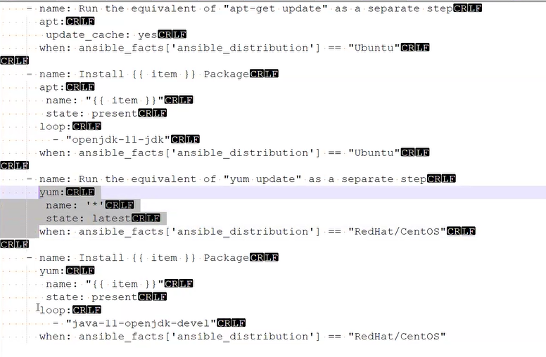
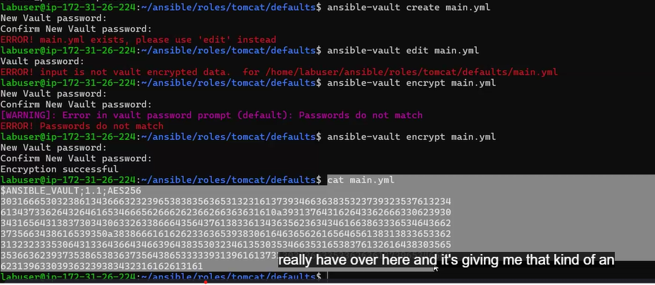

ansible webservers -m ping
ansible-playbook tomcat-10-playbook.yml
ansible-playbook tomcat-10-playbook.yml -e tomcat_user=tomcat -e tomcat_password=password

# Ansible roles
Precreated roles
https://galaxy.ansible.com/ui/standalone/roles/?page=2&page_size=10&sort=-created 

```
ansible-galaxy init tomcat
ansible-galaxy init java
```
* helps in reuseablility

we can place the commands in tasks/main.yml

user roles in the main.yml

## Using generic playbooks
```
    - name: qqq
      apt:
       update_cache: yes
      when: ansible_facts['ansible_distribution'] == "Ubuntu"
```
another example ``` when: ansible_facts['ansible_distribution'] == "Ubuntu" ``` 
also ``` when: OS == "Ubuntu" ```where os can be set as environment variable with "-e"



## run command with sudo as defualt
```
ansible-playbook main.yml -b
```

We can use put these roles in a common roles folder ~/.ansible/roles ?

# Ansible vault
Encrypt the file using ansible-vault
encrypted by using a password


```
ansible-play ask-vault-password
```

# Ansible dynamic inventory
a way to dynamically to load the hosts

# Have seperate yml to make yml files smaller
We can have under tasks folder of the respective role we can have debian.yml and cent.yml

then in main.yml inside the tasks folder  like this 
``` 
- name: Run Ubuntu Tomcat Installation
  include_tasks: debian.yml
  when: ansible_facts['distribution'] == "Ubuntu"

- name: Run CentOS Tomcat Installation
  include_tasks: centos.yml
  when: ansible_facts['distribution'] == "RedHat/CentOS"
```
